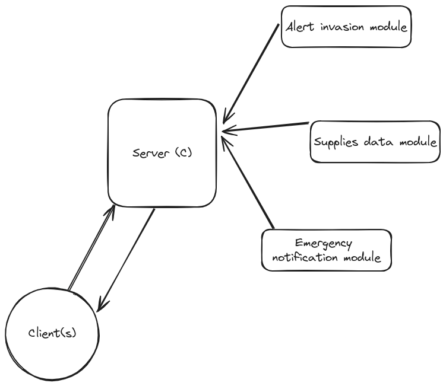

# Development of Monitoring Application for Resistance

<details>
<summary> Problem to solve... </summary>

## 🎯 Objectives

The primary purpose of this lab is for students to gain practical skills in developing client-server applications using C language, utilizing sockets for interprocess communication. Additionally, it aims to reinforce the understanding and application of an additional interprocess communication mechanism, previously covered in Operating Systems I. The discretionary choice of this mechanism is made to improve efficiency and collaboration, specifically contextualizing its use in an Industry 4.0-related scenario. The post-apocalyptic narrative of "The Last of Us" serves as a contextual framework, providing a motivating and relevant perspective for implementing these concepts in a critical survival environment.

## 📝 Evaluation Aspects

1. **Implementation of Client-Server Architecture:**
   Correct implementation of the client-server architecture using sockets in the C language.

2. **Selection and Application of Additional IPC Mechanism:**
   Effective selection and application of an additional interprocess communication mechanism, supported by a solid rationale and consideration of specific contextual needs.

3. **Thorough Validation and Testing:**
   Rigorous testing to ensure the stability and security of the application.

4. **Clear and Comprehensive Documentation:**
   Preparation of detailed documentation explaining the architecture, functionalities, and procedures for using the application, with a particular emphasis on the role of the implemented additional mechanism.

5. **Demonstrative Presentation:**
   Effective demonstration of the application in operation, highlighting the practical application of Software Engineering concepts in development.


## 📽 🎞 The story begins...

*In the remnants of a once-majestic civilization, humanity grapples with the shadow cast by an unyielding fungal infection. Joel, a leader etched with the scars of both loss and survival, finds himself standing at the pivotal junction of guiding the resistance within an underground sanctuary. Formerly a thriving industrial hub, this refuge now stands as the ultimate stronghold against the metamorphosis of the populace into hostile entities. The control room, transformed into a crucible of uncertainty, serves as the focal point for Joel's vision: a real-time monitoring application, the final beacon of hope for the resistance.*

<p align="center">
  
</p>

You are chosen for this critical mission. Your proficiency in C programming will be the key to creating an application that connects the refuge population with the critical state of the post-apocalyptic environment.

### Application Description:

<p align="center">
  
</p>

#### Clients of the Application:
People connect to the central server to receive a summary of the current state of the refuge in JSON format. The application serves as the window to hope, providing critical data on alerts, supplies, and emergency notifications. As we must preserve the security, each client will require authentication to access the start the application, this information will be the `hostanme` of the running client, as user and password. (For now, we keep this simple, but we will improve this in the future.)

Clients can connect using different devices, such as computers or tablets. The application will be available for the following protocols: TCP and UDP over IPv4 and IPv6.

#### Central Server:
Located in the control room, the central server acts as the communication nexus, sending updated summaries to clients and managing vital refuge information.

### Tasks to Implement:

#### Alerts of possible infection
Implement instant alerts for possible infected refuged. Strategic temperature sensors writes in a log file with the timestamp, the temperature of each person that enters to the refuge. If the temperature is higher than 38°C, the application will send an alert to the central server.

```text
Wed Mar 07 12:27:29 2012, NORT ENTRY,  35.6
Wed Mar 07 12:27:29 2012, EAST ENTRY,  35.6
Wed Mar 07 12:27:29 2012, WEST ENTRY,  35.6
Wed Mar 07 12:27:29 2012, SOUTH ENTRY, 38 //Here! Quarantine!
```

#### Supplies Data
Store data on essential supplies such as food and medicine. The application will provide detailed information for strategic decision-making. The only way to modify this information, if the `ubuntu` client is running (Remember the user is `ubuntu` and the password is `ubuntu`) sends the new information to the server in a JSON format. The server must validate the `hostanme` key to update the information.

```json
{
   "hostname": "hostname",
   "food": {
      "meat": 100,
      "vegetables": 200,
      "fruits": 150,
      "water": 1000
   },
   "medicine": {
      "antibiotics": 50,
      "analgesics": 100,
      "bandages": 100
   }
}

```

#### Emergency Notifications and record
Develop instant emergency notifications. If possible, unfortunately, suffer power outages or other critical situations, the server will close all the connections and send a notification to all connected clients.
The server will keep a log file with all the events that happens in the refuge. This file will be in the `/var/log/` directory, and the name will be `refuge.log`. The file will have the following format:

```text
Wed Mar 07 12:27:29 2012, Connection from new client (IP)
Wed Mar 07 12:27:29 2012, Update of supplies from client (IP) - Authorized
Wed Mar 07 12:27:29 2012, Update of supplies from client (IP) - Denied invalid hostname
Wed Mar 07 12:27:29 2012, Request of state from client (IP)
Wed Mar 07 12:27:29 2012, Alert of possible infection in ENTRY
Wed Mar 07 12:27:29 2012, Server failure. Emergency notification sent to all connected clients.
Wed Mar 07 12:27:29 2012, Connection close from client (IP)
```

#### JSON Format State Summary
Implement a refuge state summary in JSON format, providing population with key information on alerts, supplies, and emergency notifications.

```json
{
   "alerts": {
      {
         "north_entry": 1,
         "east_entry": 1,
         "west_entry": 1,
         "south_entry": 1,
      },
   },
   "supplies": {
      "food": {
         "meat": 100,
         "vegetables": 200,
         "fruits": 150,
         "water": 1000
      },
      "medicine": {
         "antibiotics": 50,
         "analgesics": 100,
         "bandages": 100
      }
   },
   "emergency": {
      "last_keepalived": "Wed Mar 07 12:27:29 2012",
      "last_event": "Server failure/Server shutdown"
   }
}
```

### Key points

Critical functionalities, such as Invasion Alerts, Supplies Data, will be implemented as static libraries, meanwhile Emergency Notifications will be a dynamic library. These libraries will be reusable components for simulating information to be sent to the server.


### Bonus
- Package the client code in RPM and DEB packages for streamlined deployment and distribution.

This lab will challenge your technical expertise as you immerse yourself in a post-apocalyptic world, where every line of code is essential for the survival of the resistance. Your task is the light in the darkness, providing survivors with the necessary tools to face an uncertain future.

### References
[Generate DEB Packages](https://youtu.be/ep88vVfzDAo)

[Generate RPM Packages](https://youtu.be/sNDs6AoNmA8)

</details>

<details>
<summary>Solution - Milstone 1</summary>

# Lab 1 - Operating Systems II
## Milestone 1 - PR description

<p align="center">
  
</p>

The big red square is what I've implemented for this M1. If you compare it with the one in the M1 PR, you'll notice the design changes I'll explain below.

### M1 notes

* Two sockets are now used to handle UDP and TCP connections to the server. My original proposal was to use four different sockets, but on further technical analysis I realised that it could be done with just two. This would also reduce the overhead as I would only need to create two child processes in the server instead of four. 
* A simple cli-based menu has been implemented for the user to interact with the server and send update or status requests. Status requests are only answered by the server if the client authentication was successful. 
* Clients use child processes to recieve messages from the server. For debugging purporses the ooutput of this child processes is redirected to the parent. This might be remove/changed. 
* The server uses two child processes one for handling TCP connections and another for handling UDP connections.
* The ports that are used for the communication are dinamically selected in the server and shared with the clients via shared memory. In the server default ports are configured, and it can be excecuted with ```-p TCP``` and/or ```-p UDP``` parameters, if the user only specifies one port the other will be assigned by the OS, and if the user doest not specify any port, both of them are assigned by the OS.
* Both UDP and TCP clients are now implemented, bi-directional communication using Json format messages is achieved.
* Basic hostname authentication is supported, but works differently for TCP and UDP clients.
    * Sience UDP clients are connection-less, they authenticate in every message they send to the server. This is done by reading the ```etc/os-release``` file, extracting the id field, putting it in utf-8 format and sending it to the server. The server validates the hostname and only if the hostname is "ubuntu" will it respond to the client that made it.
    * For TCP clients, since we have a connection based protocol, after connecting to the server, an authentication message in json format is sent to the server, this message contains the id field from the ```etc/os-release``` file. The server validates the username and sends a response to the client, this response can indicate that the authentication was successful or that it wasn't. If the authentication was not successful, the TCP client will not be able to send update requests to the server. 
  
  ### MUST HAVE improvements:
  * There is a bug i detected in TCP clients, probably caused by wrong signal/error handling. If a clients connects and then uses the "exit" option or SIGINT signal then the server is not able to receive messages from another TCP clients anymore. Will be fixed shortly. 

  ### COULD HAVE improvements:
  * Not all, but a lot of functions are common for the different clients, so there is a good amount of duplicated code. This could be fix creating a static library for common functions that all clients/TCP clients/UDP clients use. I must analyze if the amount of common functions justifies creating a library for this. 

  ### Next steps:
  * Implementation of the 3 modules/libraries. 
  * Testing. 

</details>

</details>

<details>
<summary>Solution - Milstone 2</summary>
# Lab 1 - Operating Systems II
## Milestone 2 - PR description

<p align="center">
  
</p>

* Multiple TCP clients are supported now. Now instead of creating child processes to handle every tcp connection, we use a polling technique using the select function.
* Implemented the Supplies Module. Uses shared memory with the server to hold to structures with the data for food and medicine.
* Implemented Alerts Infection Module. This module is used by a child process of the main process in the server. This child process is in charge of calling the function of the module that updates the tempeartures of the sensors for each entry (north, south, west, east). Inside the module code, the fifo is writeen. The main process of the server handles the client connections and also reads the fifo and sends the alert to all TCP/UDP clients.
* In the server i had to implement structures to store information about the connected clients. For TCP clients I use a struct that holds the amount of connected clients and an array that holds the file descriptors. For UDP clients, I use two structs (UDP is conectionless, so i cant send messages to clients with just the file descriptor). One of the structs hods file descriptor, address, familiy and length. The other struct is the list of UDP client and makes use of the first structure.
</details>

</details>

<details>
<summary>Solution - Milstone 3</summary>
# Lab 1 - Operating Systems II
## Milestone 4 - PR description (A horror story) :skull:

Overall, I think that my original proposal had a pretty good technical analysis since i was able to implement the IPC mechanisms that i orginally planed for each module :wine_glass: . But i did changed my mind a couple of times about the amount of child processes that i was going to need :cop:..

<div style="display: flex; justify-content: center;">
    <div style="flex: 1; padding: 5px; text-align: center;">
        <p>Initial Design Propsal</p>
        
    </div>
    <div style="flex: 1; padding: 5px; text-align: center;">
        <p>How it ended</p>
        
    </div>
</div>

## M4 Notes: 
* I've made the tests for the server. While doing this i had to change some functions to work a little different (Mostly avoid using global variables and take this variables as parametersm, so asserts can be done) :recycle:
* For clients I did not have enought time but I (kind of xd) tested in real lab environment ussing different devices as clients.
* I've had 4 source files for the different types of clients (UDP/TCP IPv4/IPv6). I reduced this to just two, one for TCP and another for UDP, and we can specify   if a IPV4 or IPv6 connection will be used using parameters when we run the clients. Doing this reduced a lot the amount of duplicated code.  
* I fixed a lot of small issues sience the previous MR. Moslty variable names, out of date documentation, deletion of redundant comements, deletion of spaninglish, etc.

## Achieved coverage


* For some reason my mocks code is being considered as code to test. Small defect hehe. 

## How to use the server..

Server can be executed with the following command-line options:

*  ``` ./-p tcp <tcp_port>  ``` : This option is used to specify the TCP port on which the server will listen for connections.
*  ``` ./-p udp <udp_port>  ``` : This option is used to specify the UDP port on which the server will listen for incoming connections.

* Ex: 
 ``` ./server  ```
 ``` ./server -p tcp 8080 -p udp 9090  ```
 ``` ./server -p tcp 8080  ```
 ```./server -p udp 9090  ```

## How to use the clients (both TCP and UDP)..

Clients can be executed with the following command-line options:
* ```-p <port>```    : Specify the port where the server is listening.
    * If the ```-p``` option is not provided, the program will attempt to get the ports from a shared memory segment with the server (assuming they use the same host).
* ```-t <version>``` : Specify the IP version (IPv4 or IPv6).
    * ```<version>``` can be ```v4``` or ```v6```
* ```-a <address>``` : Specify the IP address (IPv4 or IPv6).
    * For TCP IPv6 if you use a local link address (starting with fe80), you need to spiecify wich interface will be used with % notation. 
    For example: ``` ./tcp_client -a fe80::a5d7:4ab9:dc77:855%enp0s31f6```
    *  ```-t <version>``` along with ```-a <address>``` are not allowed. When specifying IP address, it's type will be inferred from it's format. 

* Running clients without any flag will set the port to chosen default port wich is ```5005``` and the default IPv4 will be the loopback IP ```127.0.0.1 ```. With this settings clients in the same host will be able to communicate. For connections from different hosts the flags must be used.

### Clients Menu Options
1. Request supplies status: Check the current status of supplies.
2. Update supplies status: Update the status of food or medicine supplies.
3. Summary: Request a summary of information.
4. Exit: Terminate the program.

## Remaining Improvements:
* More tests would be nice. I would've like to have time to implement some more complex tests for the integration of the server and the modules/libraries. 
* The file with logs is not at ```/var/log/refuge.log```. That path was giving me permisson problems and I wanted to prioritiece the implementation of the application fetures. So, in my program, when the server starts it creates a refuge.log file at ```/$HOME/.refuge```. 
* Could add a mechanism to track how much time a UDP client data has been "cached". If the client interacts with the server this time is restarted, if not when a time out ocurrs the UDP client data would be flushed from the structure.
* In the Infection Alert module I could improve the function that generates random temperture values.
* Would be nice to have a decent authentication method, what we do here is more like an end-to-end validation of the hostname.
* About maintainability, there is some functions in the libreries that are never used, I created them at some point thinking I would need them but (at lease at the current state of the project) I dont. 
* This does not affect the code (directly) but i was not able to get the coverage reports in sonarqube, the report was being generated and the sonar-scanner command detected the report, but it never showed it in the UI. To workaround this i used as reference the coverage from CDash. 
* Had no time to pack the client code into RPM or DEB packages but i'll probably do it later anyway so it's more complete and looks better on my GitHub.

## Scripts
I've provided different scripts to facilitate some things.

#### Build the full project
You can use the source code and the provided Makefile (You must have CMake installed). To build the project you can use the provided build.sh file in /scripts, just run 
>```$ ./build.sh```

## Demos :gift: 
###### (Recommend you to watch on x1.5/x1.75 speed)
* Demo 1: Server and clients running in the same host [here!](https://youtu.be/KhD3GOt2jGg)
* Demo 2 (Commented): Server and clients running in different hosts within the same LAN with ubuntu client. [here!](https://youtu.be/L0f7TXxT_HE)
* Demo 3: Client with hostname different than "ubuntu" running from a different host (Raspberry).[here!](https://youtu.be/L0f7TXxT_HE)
* And let me know if you want a more specific demo of some feature
</details>
